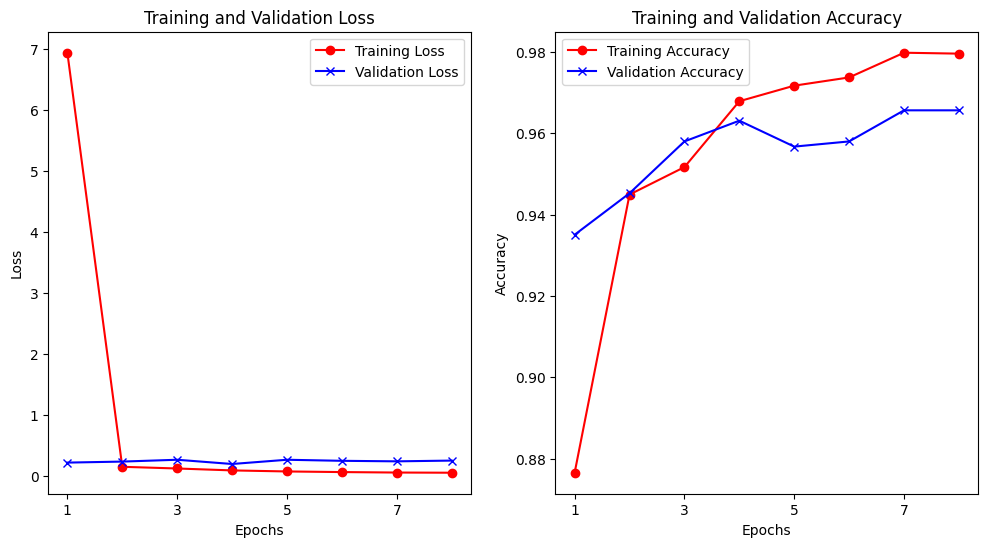
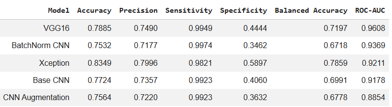
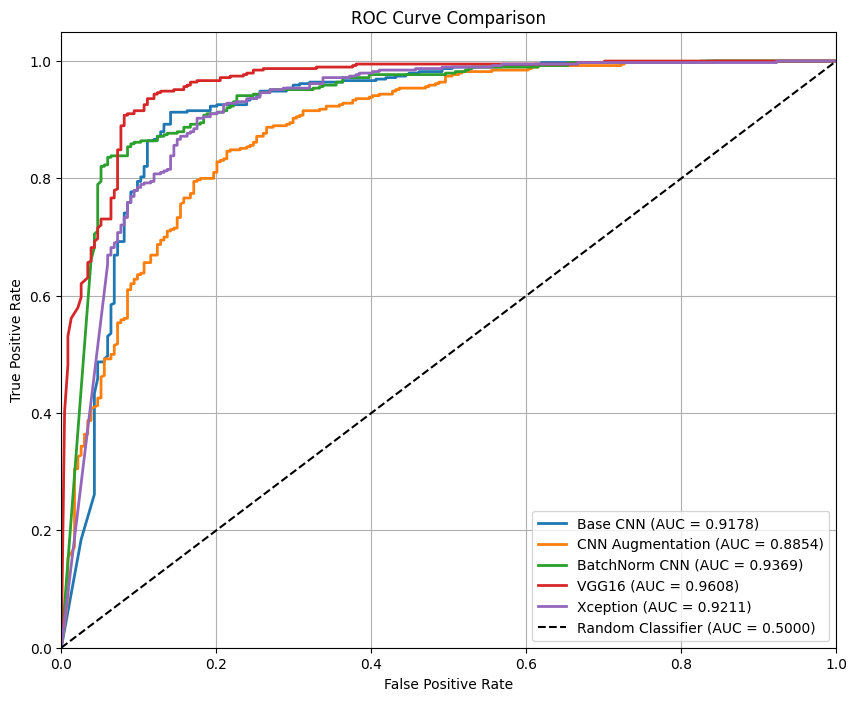
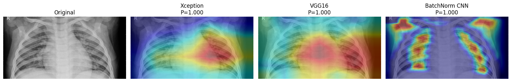
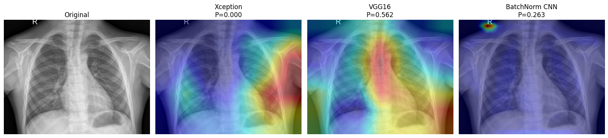

# 🧠 Model Development

This directory documents the research and development process of the deep learning model used in the **PneumoScan Junior App**.

Five convolutional neural network (CNN) architectures were developed and evaluated for automated pediatric pneumonia detection from chest X-ray images. Rather than selecting an architecture from the outset, each candidate model was trained using a consistent pipeline and compared using multiple evaluation metrics. The objective was to identify a model that achieved strong classification performance while also providing meaningful explainability through Gradient-weighted Class Activation Mapping (Grad-CAM).

Because the dataset is imbalanced, Balanced Accuracy and ROC-AUC were considered the primary model selection criteria, while Accuracy, Precision, Sensitivity, and Specificity were used as supporting metrics.

---

## 📂 Dataset

The model was trained using a publicly available pediatric chest X-ray dataset containing two classes:

- Normal
- Pneumonia

The dataset was originally published in the journal [Cell Press](https://www.cell.com/cell/fulltext/S0092-8674(18)30154-5) by Daniel S. Kermany and colleagues. The X-ray dataset contains chest radiographs (~5,900 images, JPEG format) of children aged one to five years old, collected from Guangzhou Women and Children’s Medical Center. The X-ray image dataset was made available through this [link](https://www.kaggle.com/datasets/paultimothymooney/chest-xray-pneumonia) (size ~ 2.3 Gb). 

The dataset was divided into:

- Training set
- Validation set
- Test set (unseen data, only for final evaluation)

---

## ⚙️ Preprocessing

Before training, the following preprocessing pipeline was applied:

- Image resizing
- Pixel normalization
- Data augmentation (selected experiments)
- Batch preparation using TensorFlow/Keras generators
- Binary class encoding (Normal vs Pneumonia)

---

## 🏗️ Candidate Models

Five CNN architectures were investigated throughout the development process.

| Model | Description |
|--------|-------------|
| CNN Baseline | A custom convolutional neural network used as the initial benchmark. |
| CNN + Data Augmentation | Baseline CNN combined with image augmentation techniques to improve robustness. |
| CNN + Batch Normalization | Enhanced CNN architecture incorporating Batch Normalization layers for improved optimization and training stability. |
| VGG16 Transfer Learning | Transfer learning using the pretrained VGG16 architecture. |
| Xception Transfer Learning | Transfer learning using the pretrained Xception architecture. |

The candidate architectures were evaluated under the experimental configurations documented in the training notebook. All models were assessed using the same set of classification metrics to enable performance comparison.

---

## 📈 Model Training

* The five candidate architectures were trained and evaluated as separate experiments. The development process included custom CNN architectures, architectural modifications such as Batch Normalization and data augmentation, and transfer learning using pretrained VGG16 and Xception networks.

* Model performance was evaluated using Accuracy, Precision, Sensitivity, Specificity, Balanced Accuracy, and ROC-AUC. Because the dataset exhibits class imbalance, particular attention was given to Balanced Accuracy and ROC-AUC when comparing candidate models. Detailed training configurations and experimental outputs are preserved in the accompanying Jupyter notebook.

---

## 📈 Training Process

### Training curve
<p align="center">
    
</p>

<p align="center">
<i>Figure 1. Training and validation loss and accuracy of the final Xception model.</i>
</p>

Figure 1 illustrates the learning behavior of the final Xception model. Training and validation accuracy increased consistently while the corresponding losses decreased rapidly during the early epochs before stabilizing. These curves indicate successful optimization under the selected training configuration.

---

## 📊 Model Evaluation

### Model Comparison

<p align="center">
    
</p>

<p align="center">
<i>Figure 1. Performance comparison of the five candidate CNN architectures.</i>
</p>

The candidate models exhibited different trade-offs across classification metrics. Xception achieved the highest Accuracy (83.49%), Precision (79.96%), Specificity (58.97%), and Balanced Accuracy (78.59%). VGG16 achieved the highest ROC-AUC (96.08%) and high Sensitivity (99.49%), but showed substantially lower Specificity (44.44%) and Balanced Accuracy (71.97%).

### ROC-AUC Comparison

<p align="center">
    
</p>

<p align="center">
<i>Figure 2. ROC curve comparison across the five candidate architectures.</i>
</p>

ROC analysis demonstrates that all candidate models achieved discrimination above the random-classifier baseline, although their performance differed across decision thresholds. VGG16 achieved the highest ROC-AUC (0.9608), followed by BatchNorm CNN (0.9369) and Xception (0.9211).

---

## 🏆 Model Selection: Xception

* Model selection considered performance across multiple metrics rather than relying on a single evaluation measure. Although **VGG16 achieved the highest ROC-AUC (96.08%)**, its performance was less balanced at the selected classification threshold, particularly in terms of **Specificity (44.44%)** and **Balanced Accuracy (71.97%)**.
* In comparison, **Xception achieved the highest Balanced Accuracy (78.59%)**, together with the highest Accuracy (83.49%), Precision (79.96%), and Specificity (58.97%) among the five candidate models, while maintaining a strong ROC-AUC of 92.11%.
* Given the class imbalance in the dataset, this more balanced performance across sensitivity and specificity was prioritized over selecting the model with the highest ROC-AUC alone. Xception was therefore selected as the final model for integration into PneumoScan Junior.
* In addition, Grad-CAM analysis was subsequently used as a complementary qualitative assessment of model behavior and interpretability.
* Selected final model ➡️ [Xception_final_model.keras](https://github.com/harishmuh/PneumoScan-Junior/releases/tag/v1.0.0) 
---

## 🧠 Final Xception Model

Following comparative evaluation, Xception was selected as the final architecture for deployment.

### Model Architecture

```text
                     Input Image
                  (224 × 224 × 3)
                           │
                           ▼
               Pretrained Xception CNN
                  (Feature Extraction)
                           │
                           ▼
                       Flatten
                           │
                           ▼
                      Dense (198)
                           │
                           ▼
                      Dense (128)
                           │
                           ▼
                        Dropout
                           │
                           ▼
                  Dense (1, Sigmoid)
                           │
                           ▼
                 Normal / Pneumonia
```

---

### Training Characteristics

<p align="center">
    
</p>

<p align="center">
<i>Figure 3. Training and validation loss and accuracy of the selected Xception model.</i>
</p>

The training curves show rapid improvement during the early epochs, followed by stabilization of validation performance. These curves document the optimization behavior of the selected Xception model during its original training experiment.

---

## 🔥 Explainability (Grad-CAM)

To improve model transparency, Gradient-weighted Class Activation Mapping (Grad-CAM) was incorporated into the development pipeline. Grad-CAM generates visual heatmaps highlighting image regions that most strongly influenced the model's prediction. This provides qualitative insight into model behavior and helps users better understand the decision-making process.


### True Positive Example

<p align="center">
    
</p>

<p align="center">
<i>Figure 4. Grad-CAM comparison for a correctly classified pneumonia case.</i>
</p>

### True Negative Example

<p align="center">
    
</p>

<p align="center">
<i>Figure 5. Grad-CAM comparison for a correctly classified normal chest X-ray.</i>
</p>

* The Grad-CAM examples provide a qualitative comparison of attention patterns across selected candidate architectures. In the representative examples shown, Xception produced relatively coherent activation patterns over thoracic regions compared with the alternative architectures.

* These visualizations were used as complementary interpretability evidence rather than as a quantitative measure of model performance. Grad-CAM does not establish that the model learned clinically valid diagnostic reasoning, but it provides insight into the image regions associated with individual predictions.


---

## 📝 Conclusion

* Five CNN-based approaches were investigated for pediatric pneumonia classification, ranging from custom CNN architectures to pretrained transfer-learning models.

* The experiments demonstrated that model selection based on a single metric would lead to different conclusions. VGG16 achieved the highest ROC-AUC, while Xception provided the strongest overall balance at the evaluated classification threshold, achieving the highest Balanced Accuracy, Accuracy, Precision, and Specificity among the candidate models.

* Given the class imbalance and the project's emphasis on balanced classification performance, **Xception was selected as the final model for deployment in PneumoScan Junior**. Grad-CAM was incorporated to provide complementary visual insight into model predictions.

## ⚠️ Disclaimer
This project represents an experimental and educational implementation of deep learning for pediatric chest X-ray classification. The resulting model is not intended to replace clinical interpretation or serve as a validated medical diagnostic system.


